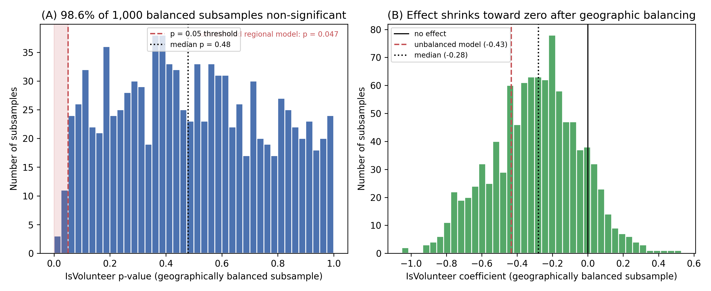
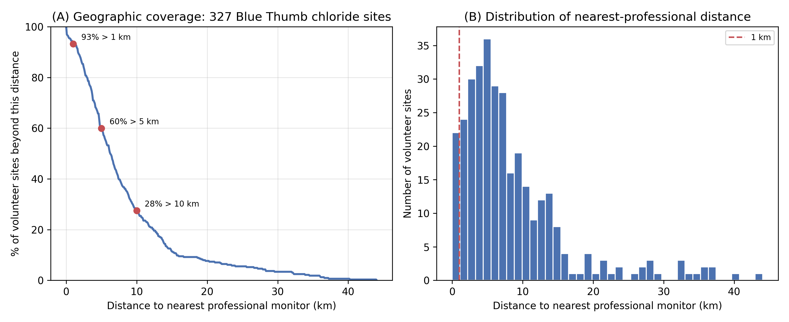

# Blue Thumb Chloride Validation

> **Principal Investigator:** Miguel Ingram (Black Box Research Labs LLC)
> **Institutional Partner:** Oklahoma Conservation Commission (OCC), Blue Thumb Program

Can volunteer chloride data be used alongside professional agency data at landscape scale? This repository validates Oklahoma Blue Thumb citizen-science chloride measurements against professional EPA Water Quality Portal records across three independent lines of evidence: within-instrument **precision**, 18 years of **accuracy** against known standards, and a regional **mixed-effects model** whose apparent observer bias turns out to be a **geographic artifact**, on top of the program's **irreplaceable spatial coverage**.

  

> **One-command verification:** every headline number in the manuscript (`paper/main_v2.tex`) reproduces from committed data via `python verify.py` (about 5 s), and the same check runs in CI on every push. See [QUICKSTART.md](QUICKSTART.md) and [CLAIMS.md](CLAIMS.md).

---

## The headline result



A regional mixed-effects model reports an apparent volunteer low bias (IsVolunteer beta = -0.433, p = 0.047). But the 80 volunteer sites and 12 professional sites have **zero geographic overlap** along Oklahoma's West-East salinity gradient, so that coefficient cannot separate "volunteers measure differently" from "volunteer sites have different water." Balancing the geography and re-fitting across **1,000 stratified subsamples**, the effect is **non-significant in 98.6%** of them (median p = 0.48). The apparent bias was in the streams, not the volunteers.

---

## Three lines of evidence

| Line | Result | N |
|:---|:---|:---|
| **Precision** | 97.3% of titration replicate pairs agree within one drop; the apparent edge over professionals (1.53 vs 2.51 mg/L mean absolute difference) is the 5 mg/L quantization floor, not greater skill | 2,566 pairs |
| **Accuracy** | Volunteers read slightly **high** (+4 to +5 mg/L at concentrations at or below 100 mg/L) against known standards, ruling out systematic under-counting | 867 indoor QA tests, 2007-2025 |
| **Regional model** | Apparent low bias (beta = -0.433, p = 0.047) dissolves to non-significance (p = 0.54) once the geographic confound is balanced | 895 obs, 92 sites |
| **Coverage** | 93% of Blue Thumb chloride sites are more than 1 km from the nearest professional monitor: the volunteer record is the only record for most of these streams | 327 sites |

Regional GLMM: `log(Chloride) ~ IsVolunteer + sin(2*pi*t/365) + cos(2*pi*t/365) + Longitude + (1|Site)`, REML.

| Fixed Effect | beta | SE | p |
|:---|:---|:---|:---|
| **IsVolunteer** | **-0.433** | **0.218** | **0.047** (apparent; see headline result) |
| Longitude | -0.435 | 0.078 | < 0.001 |
| Seasonal (sin) | +0.110 | 0.023 | < 0.001 |
| Intercept | -37.663 | 7.640 | < 0.001 |

**Identifiability:** 0 of 92 sites contain both observer types (variance inflation factor for IsVolunteer = 1.29), so the regional coefficient is not interpretable as a pure observer effect. The stratified-subsampling test above is what resolves it. Full output: `data/outputs/phase2_lme/phase2_lme_results.txt`.

---

## Geographic coverage



93% of the 327 Blue Thumb chloride sites are more than 1 km from any professional monitor (60% beyond 5 km, 28% beyond 10 km, Haversine distance). The program's value is not that it duplicates professional sensors; it is that it covers streams no one else measures.

---

## Reproducing key results

**Tier 1 - fast verification (no raw data needed, about 5 s to 1 min):**

```bash
python3.11 -m venv venv && source venv/bin/activate
pip install -r requirements.txt
python verify.py
```

`verify.py` recomputes all six headline claim groups (precision, accuracy, regional GLMM, stratified subsampling, identifiability, coverage) from committed derived data, prints a PASS/FAIL table, and exits non-zero on any mismatch. The same command runs in CI (`.github/workflows/ci.yml`) on every push and pull request. The expected values are the numbers the manuscript states; each is pinned in `verify.py` with a citation to its line in `paper/main_v2.tex`.

**Tier 2 - full reproduction from source data:**

```bash
python scripts/generate_verification_data.py   # rebuild committed derived files from raw sources
python scripts/phase2_lme_analysis.py          # variance decomposition + regional LME
python scripts/stratified_subsampling.py 1000 42  # the 1,000-seed primary result (98.6%)
python scripts/make_figures.py                 # regenerate the two result figures
```

Tier 2 requires the OCC and EPA source files (see Data Availability in the manuscript). Tier 1 uses a fast 200-draw subsample asserting > 95% non-significant; the committed 1,000-seed run yields 98.6%.

Full details: [QUICKSTART.md](QUICKSTART.md). Claim-by-claim mapping (stated value to paper line to script to check): [CLAIMS.md](CLAIMS.md).

---

## Data pipeline and tests

The `src/` package handles EPA WQP extraction and data preparation; it also produces the spatial-temporal matched pairs used in earlier analysis. The v2 results themselves come from the `scripts/` and `verify.py` steps above, so this pipeline is mainly for rebuilding the inputs from raw sources.

```bash
python -m src.pipeline                 # full run (downloads EPA WQP data)
python -m src.pipeline --skip-extract  # use cached raw data

# or step by step:
python -m src.extract     # download from EPA WQP
python -m src.transform   # clean, separate, load the volunteer export (SHA-256 verified)
python -m src.analysis    # spatial-temporal matching
python -m src.visualize   # validation plots

pytest tests/test_pipeline.py -v       # pipeline test suite
```

---

## Data sources

| Source | Type | Access |
|:---|:---|:---|
| **EPA Water Quality Portal** | Professional chloride measurements | Public API (`waterqualitydata.us`), public domain |
| **OCC R-Shiny export** | Blue Thumb volunteer chloride measurements | [OCC portal](https://occwaterquality.shinyapps.io/OCC-app23a/); SHA-256 verified at runtime; not in the WQP |
| **OCC Rotating Basin / indoor QA** | Professional QA duplicates and 18-year volunteer proficiency tests | Provided by OCC; restricted (see manuscript Data Availability) |

Blue Thumb volunteer data is **not** in the EPA WQP; it lives in a separate, programmatically accessible OCC system. That separability is precisely what makes this retrospective validation possible (and why the same approach cannot be applied to programs that do not publish their volunteer data, such as Missouri Stream Team and Georgia Adopt-A-Stream).

---

## Methodology

**Regional mixed-effects model and geographic-confound test.** A linear mixed-effects model on all volunteer and professional records within the Rotating Basin QA window (2022-2024, north-central Oklahoma; 895 observations, 92 sites): `log(Chloride) ~ IsVolunteer + seasonal harmonics + Longitude + (1|Site)`, REML. Because volunteer and professional sites do not overlap geographically, the IsVolunteer coefficient is confounded with site; the confound is tested by drawing 12 volunteer sites (3 per longitude quartile) to match the 12 professional sites and re-fitting, repeated over 1,000 seeded subsamples (`scripts/stratified_subsampling.py`).

**Precision and accuracy.** Variance decomposition of within-test titration replicate pairs and professional QA duplicates; 18 years of indoor QA against known standard solutions.

**Coverage.** For each of the 327 volunteer sites, the Haversine great-circle distance to the nearest professional monitoring station in the full EPA WQP Oklahoma dataset.

All parameters are in `config/config.yaml`. Full methods are in the manuscript, `paper/main_v2.tex`.

---

## Repository structure

```
ok-blue-thumb-data-validation/
├── README.md
├── QUICKSTART.md                      # two-tier reproduction guide
├── CLAIMS.md                          # claim -> value -> paper line -> script -> check
├── verify.py                          # one-command verification (30 checks)
├── requirements.txt
├── .github/workflows/ci.yml           # runs verify.py on every push/PR
├── paper/
│   ├── main_v2.tex                    # the manuscript (PeerJ format)
│   └── main_v2.pdf
├── config/config.yaml
├── src/                               # WQP extraction + data-prep pipeline
│   ├── pipeline.py  extract.py  transform.py  analysis.py  visualize.py
├── scripts/
│   ├── phase2_lme_analysis.py         # variance decomposition + regional LME
│   ├── stratified_subsampling.py      # the primary-result geographic-confound test
│   ├── make_figures.py                # the two result figures + per-draw distribution
│   ├── generate_verification_data.py  # rebuild committed derived files
│   ├── zenodo_deposit.py              # prepare a Zenodo deposition draft
│   └── diagnose_matches.py  verify_arcgis_sync.py  arcgis_qaqc_audit.py
├── tests/test_pipeline.py
└── data/outputs/phase2_lme/           # committed derived data + figures
```

### Committed figures (viewable without running anything)

- [primary_result_subsampling.png](data/outputs/phase2_lme/primary_result_subsampling.png) - the geographic-confound test (primary result)
- [coverage_curve.png](data/outputs/phase2_lme/coverage_curve.png) - geographic coverage
- [variance_decomposition.png](data/outputs/phase2_lme/variance_decomposition.png) - precision
- [quantization_effect.png](data/outputs/phase2_lme/quantization_effect.png) - the 5 mg/L drop-count floor
- [qa_accuracy_analysis.png](data/outputs/phase2_lme/qa_accuracy_analysis.png) - indoor QA accuracy
- [site_distribution_map.png](data/outputs/phase2_lme/site_distribution_map.png) - volunteer vs professional site distribution
- [lme_diagnostics.png](data/outputs/phase2_lme/lme_diagnostics.png) - regional model residual diagnostics

---

## Phase 1 History

An initial analysis (N=48, R-squared=0.839, 100m/48h matching) was completed in January 2026 using `OKCONCOM_WQX` data from the EPA WQP as "volunteer" data. On January 21, 2026, OCC's Kim Shaw clarified that `OKCONCOM_WQX` contains OCC Rotating Basin professional data (Method 9056), not Blue Thumb volunteers. Phase 2 corrects this by sourcing volunteer data from a separate OCC export, verified against OCC's ArcGIS FeatureServer (2,026 of 2,027 overlapping records match exactly). Phase 1 results are preserved in git history.

---

## License

MIT License (code), see `LICENSE`. The manuscript text and figures are intended for CC-BY 4.0 release with publication.
